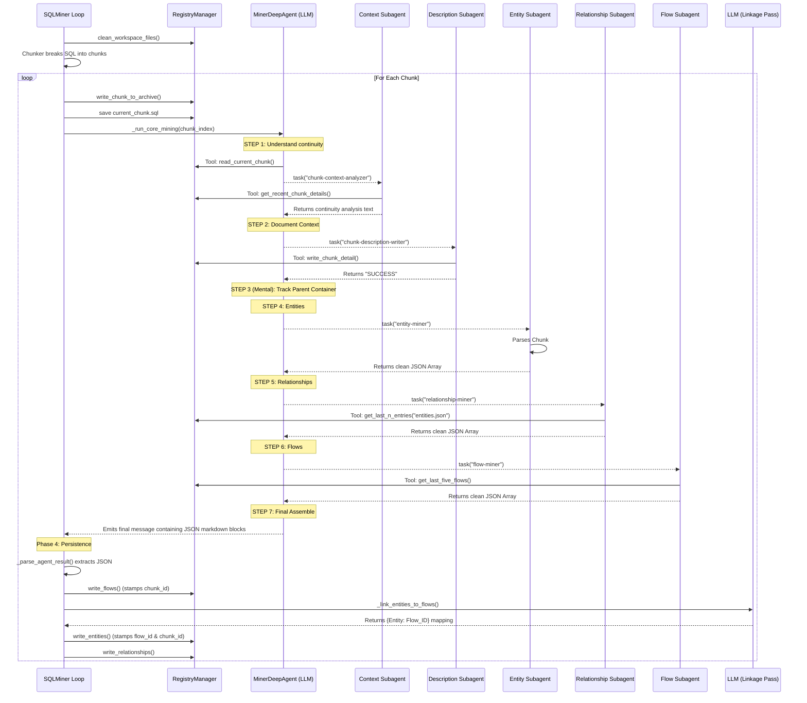

# SQL Miner Execution Flow

This document details the exact sequence of events, tool calls, and subagent invocations when `SQLMiner.run()` is executed. It illustrates how the system breaks down codebase context and orchestrates the LangChain `MinerDeepAgent`.

## System Execution Flow Diagram

## Step-by-Step Breakdown

### Phase 1: Setup & Pre-processing
When you initiate the routine using `miner.run(sql_code)`:
1. **Workspace Clear**: `RegistryManager` clears out existing data safely from the `mining/output` and `mining/state` directories using `clean_workspace_files()`.
2. **Chunking Engine**: The `SQLChunker` divides the long code string into overlapping functional fragments defined by your `window_size` and `overlap`.

### Phase 2: Starting the Loop (`_run_core_mining`)
For each individual code block (`chunk_index`), the loop:
1. Archives the code permanently to `output/chunks/<id>.sql`.
2. Temporarily registers it to `state/current_chunk.sql`.
3. Injects 5 mapped `LangChain` subagents alongside the standard local file-reading registry tools into the primary `MinerDeepAgent`.

### Phase 3: The Orchestrator's Deep Agent Processing
Driven by the `miner_prompt.md` instructions, the overarching LLM instance now manages the work queue for the chunk:

1. **Context Initialization**: The agent calls `read_current_chunk` for itself and triggers the **`chunk-context-analyzer`** via the subagent `task` framework. The subagent compares the active file with `get_recent_chunk_details()` to tell the orchestrator where we are in the script's lifespan.
2. **Documentation**: It passes control to **`chunk-description-writer`**, a dedicated subagent allowed to invoke `write_chunk_detail` so later modules have fresh memory context saved into the registry.
3. **Entity Extraction**: Invokes **`entity-miner`**. The miner scopes through the codebase explicitly grabbing packages, triggers, queries, etc., bypassing variables, and returns a JSON array back strictly to the delegating agent.
4. **Relationship Linking**: Invokes **`relationship-miner`**. Since previous objects might overlap with the current chunk, this sub-bot uses `get_last_n_entries` reading `entities.json` dynamically to maintain relational continuity. Returns a JSON array.
5. **Architectural Hierarchy**: Invokes **`flow-miner`**. Queries previous flows via `get_last_five_flows` so nested execution identifiers run uninterrupted. Returns a sequential JSON array.
6. **Data Compilation**: The master `MinerDeepAgent` gathers the subagent arrays and responds back to the python script directly with defined `**Entities**`, `**Relationships**`, and `**Flows**` regex boundaries.

### Phase 4: Parsing and Final File Writing (`_persist_result`)
The agent's text stream exits out back to your standard Python loop:

1. `_parse_agent_result` strips out the surrounding Markdown output via regex matching and extracts the exact python arrays.
2. **Flows** immediately get annotated with the current `chunk_id` and are saved to `flows.json` via the registry manager.
3. An explicit LLM-powered AI mapping pass occurs (`_link_entities_to_flows`). Using just the JSON payloads, it figures out specifically what flow ID context every entity belongs to inside this exact chunk.
4. Finally, **Entities** (now augmented with `chunk_id` and `flow_id`) and **Relationships** are committed to their output tables via the `RegistryManager` batch writers (`write_entities`, `write_relationships`).
